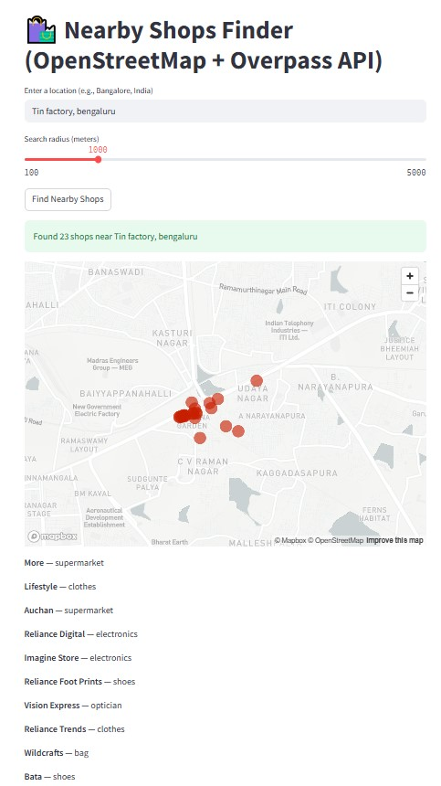

# 📍 Nearby Shops Finder

Welcome to the **Nearby Shops Finder**, your go-to app for discovering local businesses powered by **OpenStreetMap** 🗺️ and the **Overpass API** 📡! Whether you're new to a city or just exploring your neighborhood, this tool helps you pinpoint shops with ease.

## ✨ Features

* **Location-Based Search:** Find shops around any specified location worldwide 🌍.
* **Adjustable Radius:** Customize your search area from 100 to 5000 meters 📏.
* **Interactive Map:** Visualize shop locations on a map for quick navigation 🗺️.
* **Shop Details:** Get basic information about each shop, including its name and type 🏷️.

## 🚀 How to Run Locally

Get this awesome app up and running on your machine in a few simple steps!

1.  **Clone the Repository:**
    ```bash
    git clone [https://github.com/harshitsingh09/Shops-near-me.git](https://github.com/harshitsingh09/Shops-near-me.git)
    cd Shops-near-me
    ```

2.  **Install Dependencies:**
    Make sure you have `streamlit` 🎈, `requests` 🔗, and `pandas` 🐼 installed. If not, you can install them using pip:
    ```bash
    pip install streamlit requests pandas
    ```

3.  **Run the Streamlit App:**
    ```bash
    streamlit run app.py
    ```

## 📸 Sneak Peek



## 🤝 Contributing

Got ideas to make this even better? We'd love your contributions! Feel free to fork the repository 🍴, make your changes 🛠️, and open a pull request 📤.

## 📄 License

This project is open-source and available under the [MIT License](https://www.google.com/search?q=LICENSE) 📜.
